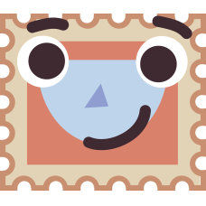
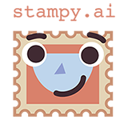
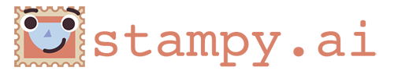
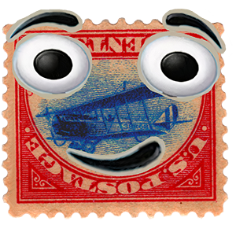

# Stampy Assets

Stampy is the friendly face of a `stampy.ai`, a source for comprehensive FAQ on artificial general intelligence (AGI) safety and [AI alignment](https://en.wikipedia.org/wiki/AI_alignment), backed by a growing community of like-minded volunteers.

## The `stampy.ai` Logo

Everyone is encouraged to incorporate the Stampy logo on their websites, brochures, packaging, and elsewhere when referring to `stampy.ai`. The official logo available in 2 forms, [wide](wide) and [tall](tall). 

[Icons](favicon) and [profile picts](profile) profiles are also available in multiple sizes.
 

## Story of the Logo

The current logo is a modernized rendition of the [original logo](old) inspired by the valuable 
[inverted Jenny stamp](https://en.wikipedia.org/wiki/Inverted_Jenny) 
and the face of the friendly 
[Microsoft Clippy office assistant](https://en.wikipedia.org/wiki/Office_Assistant) with a nod to the paperclip maximizing conundrum presented by Nick Bostrom's [Superintelligence](https://en.wikipedia.org/wiki/Superintelligence:_Paths,_Dangers,_Strategies).

© 2022 stampy.ai and Rob Miles
